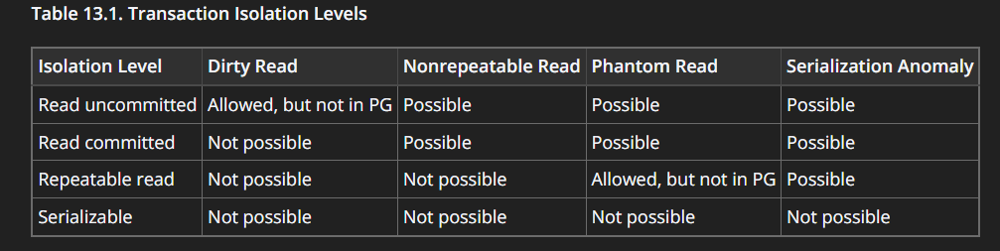

**In a transaction, if I perform multiple updates and an error happens in the third statement, but I have not used SAVEPOINT, what will happen if I issue a ROLLBACK?**  
Will my first two updates persist?  
- No they will not persist. They will be rolled back.

<br>
<br>

**Suppose Transaction A updates Alice’s balance but does not commit. Can Transaction B read the new balance if the isolation level is set to READ COMMITTED?**  
- No, in read committed only committed data can be read.

**What will happen if two concurrent transactions both execute:**
```sql
UPDATE tbl_bank_accounts SET balance = balance - 100 WHERE account_name = 'Alice';
```
at the same time? Will one overwrite the other?  
- No thanks to row level locking (first trans acquires lock, either commits or rollbacks the transaction then similar sequence will be followed by second trans. so on and on).

**If I issue `ROLLBACK TO SAVEPOINT after_alice;`, will it only undo changes made after the savepoint or everything?**  
- It will undo changes made after the savepoint.

**Which isolation level in PostgreSQL prevents phantom reads?**  
- Repeatable read and serializable



---

**Can Postgres perform a dirty read (reading uncommitted data from another transaction)?** 
- Not allowed in pg

**If autocommit is ON (default in Postgres), and I execute an UPDATE, is it safe to assume the change is immediately committed?** 
- Yes

**If I do this:**
```sql
BEGIN;
UPDATE accounts SET balance = balance - 500 WHERE id = 1;
-- (No COMMIT yet)
```
And from another session, I run:
```sql
SELECT balance FROM accounts WHERE id = 1;
```
Will the second session see the deducted balance?  
- No. It is because default behaviour of autocommit is disabled if we use begin statement.