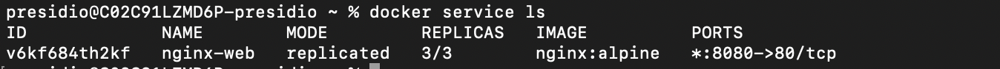
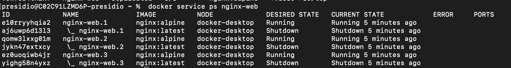
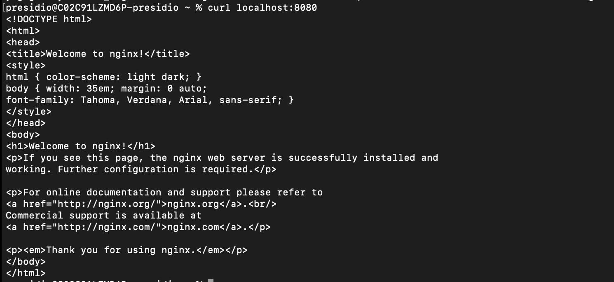

```
docker swarm init
```

```
docker service create --name nginx-web --replicas 3 -p 8080:80 nginx
```


```
docker service ls
```



```
docker service ps nginx-web
```


```
curl localhost:8080
```


```
docker service scale nginx-web=5
```