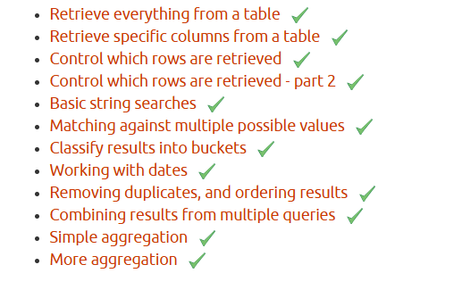

Compiled today's task in this file

```sql
select t.title, ath.au_lname from titles t left outer join titleauthor a on t.title_id=a.title_id join authors ath on a.au_id=ath.au_id;

SELECT p.pub_name, t.title, s.ord_date 
FROM publishers p JOIN titles t ON p.pub_id = t.pub_id
JOIN sales s ON s.title_id = t.title_id;

create procedure procedure_1
as
begin
	print 'good morning'
end

exec procedure_1

create table Products(
	id int identity(1,1) constraint pk_productId primary key,
	name varchar(100) not null,
	details nvarchar(max) not null
)

create or alter procedure InsertToProducts (@name varchar(100), @details nvarchar(max))
as 
begin
	insert into Products(name,details) values(@name,@details)
end

InsertToProducts 'Laptop','{"brand":"Dell","spec":{"ram":"16GB","cpu":"i5"}}'

create procedure UpdateSpec(@pid int,@newvalue varchar(20))
as 
begin
	update Products set details=JSON_MODIFY(details,'$.spec.ram',@newvalue) where id=@pid
end

UpdateSpec 1,'128GB'


```

